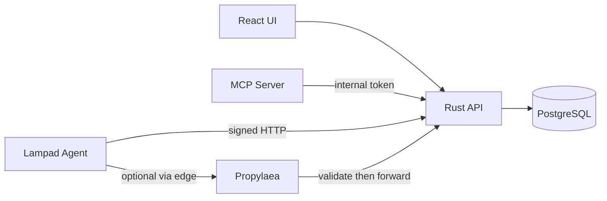

# Architecture

## Components

| Layer | Role |
|---|---|
| **API** | Auth (password + WebAuthn), operators, agents, proxies, commands, audit, backup |
| **UI** | Operator dashboard; session cookies; no embedded secrets |
| **MCP** | Client bridge (Cursor, Claude, Hermes, …); calls internal API routes only |
| **Propylaea** | Internet-facing agent proxy; early Ed25519 / enroll validation; `/api/v1/agent/*` only |
| **Protocol** | Shared serde types between API, lampad agents, and Propylaea |

## Request paths

- **Public/operator**: `/api/v1/auth/*`, `/api/v1/admin/*` — session required after login.
- **Agent**: `/api/v1/agent/*` — Ed25519 signed payloads (direct to Hecate or via Propylaea).
- **Proxy**: `/api/v1/proxy/*` — Propylaea enroll (token) + signed sync/heartbeat.
- **Internal**: `/internal/*` — bearer `INTERNAL_TOKEN` (MCP, automation).

## Deployment

Docker Compose runs Postgres on an internal network, API on internal + frontend, MCP on frontend only. Published host ports for API/MCP default to loopback. Optional Caddy profile terminates HTTPS (no plaintext `:80`) and proxies to the API and MCP.

UI static assets are built into the API image (`/opt/hecate/ui/dist`) for co-deployment; dev uses Vite with proxy.

## Data

PostgreSQL holds operators, credentials, agents, commands, audit log, and settings. Migrations ship with the API binary and run at startup.
